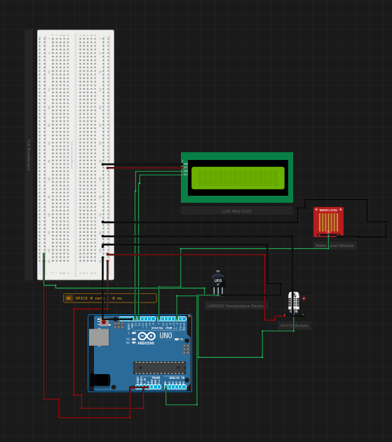

# Weather Station

> Built in [Breadboard](https://breadboard.hackclub.com), a Hack Club program. This project took ~2 hours of work.

## What It Does

Weather Station that tracks weather, humidity and percciptation

## How It Works

The circuit is captured in `breadboard-project.json`, and the firmware that runs it is in the `firmware/` folder.

## How To Use It

Wire everything together then plug in the Arduino. Once I build and debug the code it should work.

## Demo

- **Simulate it live:** [https://breadboard.hackclub.com/share/20](https://breadboard.hackclub.com/share/20), runs the firmware in the Breadboard simulator
- **View the design:** [https://taniwankenobi.github.io/breadboard-plays/p/20/](https://taniwankenobi.github.io/breadboard-plays/p/20/)

## Schematic

The editor snapshot is in `breadboard-project.json`.

## Bill of Materials

| Part | Quantity |
| --- | --- |
| breadboard-full | 1 |
| dht11 | 1 |
| lcd1602 | 1 |
| lcd1602-i2c | 1 |
| lm35dz | 1 |
| water-level-sensor | 1 |

## Firmware

Firmware files are in the `firmware/` folder.

## Build Journal

Build journal entries are kept in [`journals.md`](journals.md).

---

*Made in [Breadboard](https://breadboard.hackclub.com) — 2h of work*

